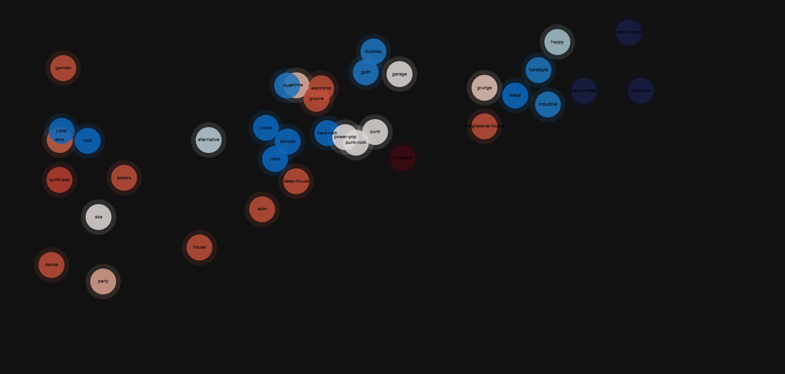

## Dataset Setup

1. Download the dataset manually
   from [Kaggle – Spotify Tracks Dataset](https://www.kaggle.com/datasets/maharshipandya/-spotify-tracks-dataset)
2. Place it under: ***data/raw_data/dataset.csv***
3. Then run the notebook `music_popcorn.ipynb`.

# Spotify Genre Clustering & Popcorn Map

This project explores the musical genres and their relationships using audio features from a large Spotify dataset.
By applying dimensionality reduction via UMap and K-Means for clustering, an interactive Popcorn map is created,
that visualizes which genres can be grouped into genre clusters by similar features and how genres are similar
to others.

The outcome is an interactive visualization that shows how genres relate
to each other based on acoustic features.

---

## Motivation

This project explores if genre similarity can be derived from audio features alone and visualized
in a way that is both intuitive and informative.

The goal is to:

- Identify genre clusters by clustering
- Analyze genre composition within clusters
- Visualize genre similarity in a popcorn map

---

## Dataset

The dataset contains 144 thousand spotify songs with 125 genres over all songs. The audio features per song are:

- energy
- loudness
- speechiness
- acousticness
- instrumentalness
- valence
- tempo
- duration

All tracks are also already associated with a genre label (`track_genre`).

---

## Methodology

### 1. Dimensionality reduction

- UMAP with 2 Dimensions for visualization

### 2. Clustering

- K-Means clustering on the standardized feature space

### 3. Genre aggregation

- Genre centers are represented by the median position of their songs
- Genre colors are identified by most dominant cluster per genre group

---

## Evaluation

To also interpret the clusters and their content,the dominant genres and their relative proportions, for every cluster, are
computed.

This makes it possible to:

- Identify, which genres are contained in which clusters
- Identify well-defined genre clusters
- Detect mixed or transitional clusters

---

## Outcome: Popcorn Map

The final result is an interactive Popcorn Map:

- Each bubble represents a genre
- Spatial proximity indicates acoustic similarity
- Color indicates the dominant cluster
- Every genre bubble is labeled on hover with the number of its dominant cluster and the dominant genre for that cluster
- Relationships between genres and their cluster (colors of the genres) and between different genres are displayed

## Overview of the resulting Popcorn Map:

### Full View:

### Zoomed in:

- **Upper Left Quarter:**
  

- **Upper Right Quarter:**
  

- **Lower Left Quarter:**
  

- **Lower Right Quarter:**
  

---

