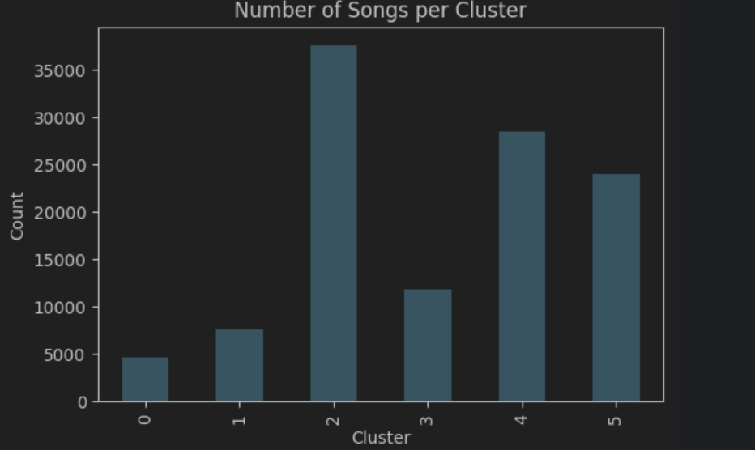
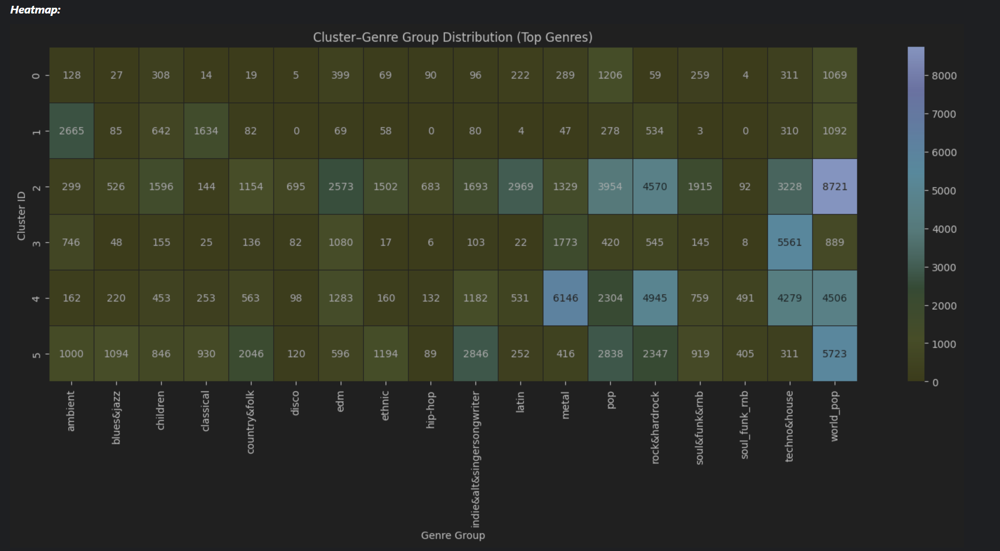

## Dataset Setup

1. Download the dataset manually from [Kaggle – Spotify Tracks Dataset](https://www.kaggle.com/datasets/maharshipandya/-spotify-tracks-dataset)
2. Place it under: ***data/raw_data/dataset.csv***
3. Then run the notebook `01_data_preparation.ipynb`.

## K- Clustering results visualisations from notebook 03_cluster_analysis.ipynb:
### K-Clustering with 6 Clusters:

**Distribution of songs for Clusters:**

  

**Visualisation of distribution of major genre groups across the Clusters:**

